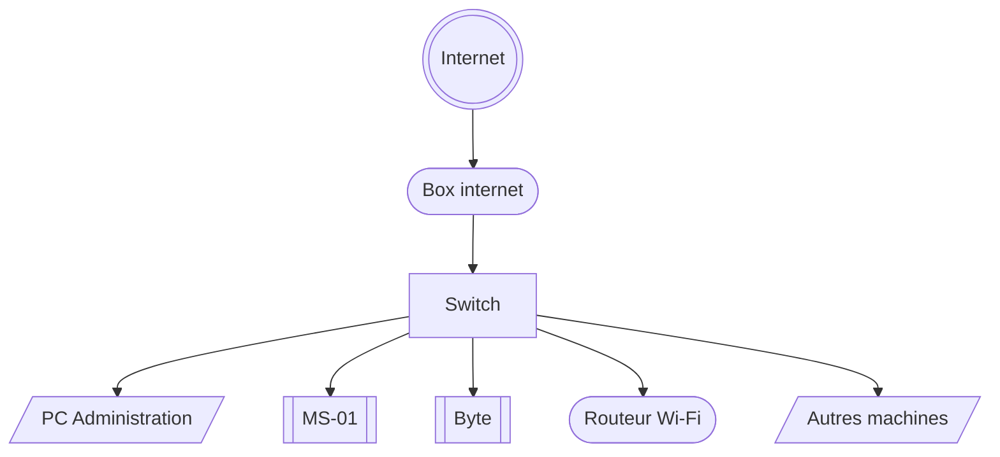

# Architecture de mon Homelab
## Diagramme physique



## Diagramme logique

```mermaid
flowchart TB


INT((Internet))

BOX[[Box internet]]
FIR1(Firewall Box)
FIR2(Firewall OPNSense)
DHCP1(DHCP BOX)
DHCP2(DHCP OPNSense)
HYP1(Hyperviseur 1)
HYP2(Hyperviseur 2)
SW[Switch]
TECH["VM Technique(Ubuntu)"]
WSRV[Windows serveur]
WCLT[Windows Client]
DEB[Serveur de test]
LIN[VM de test]
SUP[VM de supervision]
TRUE[TrueNAS]
PBS[Proxmox Backup Server]
STC[(Datastore)] 
OPN(OPNSense)
ADM[/Poste admin/]
WIFI[[Wi-Fi]]
MCH[/Autres machines pysiques/]

INT --- BOX --- FIR1 --- DHCP1 --- SW

subgraph VLAN1[Réseau Administration]
direction TB
ADM
end

subgraph VLAN2[Réseau Infra]
direction TB
HYP1 --- OPN --- FIR2 --- DHCP2 --- WSRV
DHCP2 --- WCLT
DHCP2 --- TECH
DHCP2 --- SUP
end

subgraph VLAN3[Réseau Backup]
direction TB
HYP2 --- PBS --- TRUE --- STC
end

subgraph VLAN4[Réseai de test]
direction TB
DEB --- LIN
end

subgraph VLAN5[Réseau Wi-Fi]
direction TB
WIFI
end

subgraph VLAN6[Autres machines physiques]
direction TB
MCH
end

SW --- VLAN1
SW --- VLAN2
SW --- VLAN3
SW --- VLAN4
SW --- VLAN5
SW --- VLAN6

