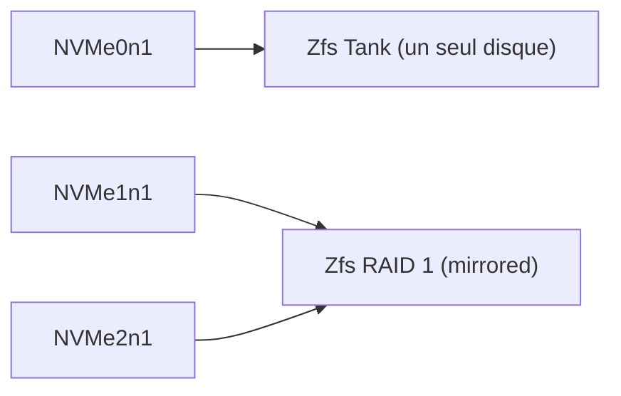

## Objectifs

Pour l'installation de proxmox sur mon MS-01 comme hyperviseur principale, je décide me servir de 3 disques NVMe de 4To, avec la configuration suivante



## Mise en place

Le miroring Zfs RAID 1 étant créé à l'installation de proxmox, je  créé donc le pool Zfs sur le 3e disque.

Je determine des dossiers pour chaque type de contenu histoire de bien tout séparer

La structure se présente de cette façon:

- Au niveau des pools Zfs

    ```
    pool: rpool
    | rpool
    |   mirror-0
    |       nvme-eui.0025384a5141f3b6-part3
    |       nvme-eui.0025384c51404329-part3

    pool: tank
    |   tank
    |       nvme0n1

    ```
- Au niveau du Storage Proxmox

    | ID | Type | Content | Path/Target |
    | --- | --- | --- | --- |
    | local-zfs | ZFS | Disk images, Container | | 
    | tank-vm | ZFS | Disk images, Container |  |
    | local | Directory | Import | /var/lib/vz |
    | tank-backup | Directory | Backup | /tank/backup |
    | tank-iso | Directory | ISO image | /tank/iso |
    | tank-snippets | Directory | Snippets | /tank/snippets |
    | tank-templates | Directory | Container template | /tank/templates |


 

